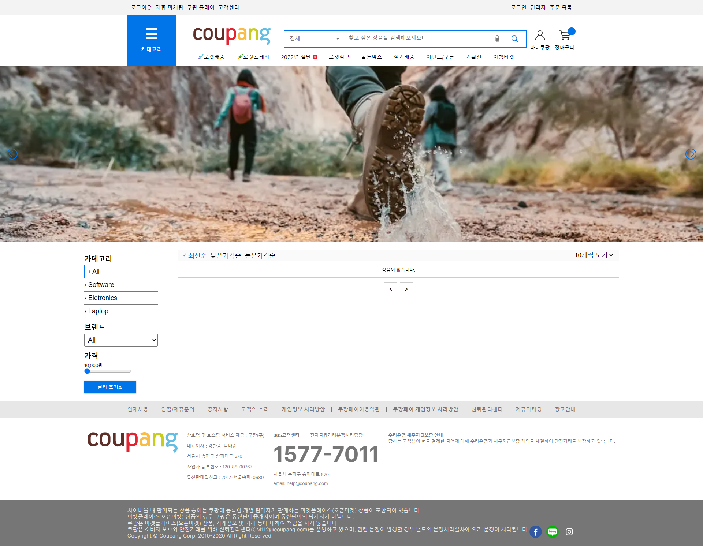
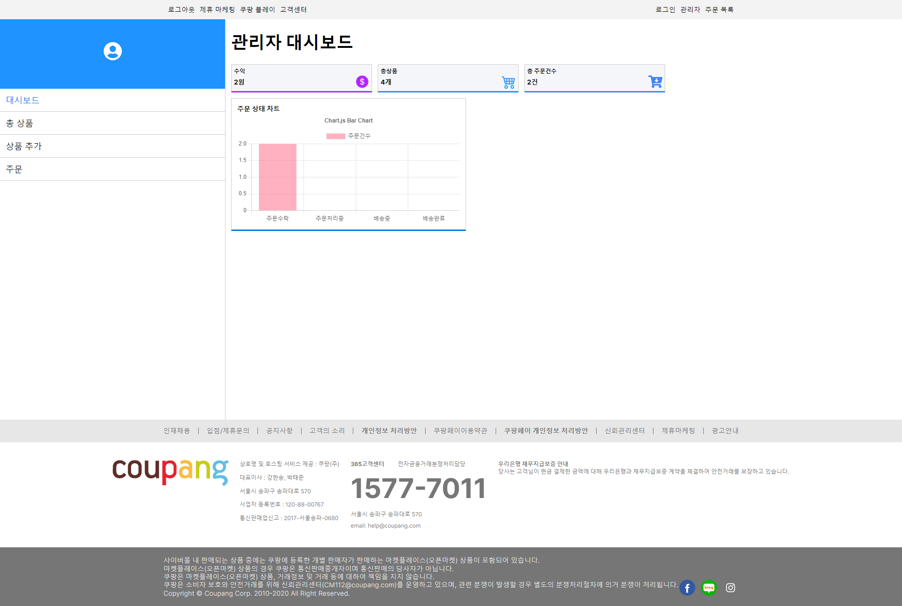

# FastCampus_100scenario

본 레포지토리는 [패스트캠퍼스 강의 링크](https://fastcampus.co.kr/dev_online_fe100)를 수강하며 공부한 레포지토리입니다.

## part[1~4]

> **쿠팡의 홈페이지를 클론코딩합니다.** [https://www.coupang.com/](https://www.coupang.com/)


메인 페이지

관리자 페이지

#### 사용된 기술

- Nextjs 13
- firebase
- redux
- sass
- tosspayment
- 기타 디자인 라이브러리 및 유틸리티 라이브러리 (toastify, icons, loader etc..)

#### 실행 방법

```
$ cd e_commerce_product
$ npm install
$ npm run dev
```

##### 약간의 강의 후기

최근 여러 프로젝트에서 typescript를 제거하고 있는데, 해당 프로젝트에서 javascript로 먼저 project를 작성하면서 typescript는 여전히 필요한 존재라는 생각을 하게 되었다.

sass와 redux는 리액트를 처음 공부하면서만 사용하고 tailwind나 recoil같은 비교적 최신 라이브러리들을 사용해왔는데, 각각의 장단점을 한 번 더 비교해볼 수 있었고 프로젝트에서 사용할 라이브러리를 결정할 때 고민할 수 있는 계기가 되었다.

redux devtools로 디버깅을 많이 했는데, 다른 상태 관리 라이브러리들도 devtools가 있는지 궁금해서 찾아보았다. [recoil devtools](https://recoiljs.org/docs/guides/dev-tools/) 옛날부터 devtools를 개발 중이라고 했던 기억이 잠시 나는데, 아직도 개발 중이어서 extension을 찾아보니 [recoil extension](https://chrome.google.com/webstore/detail/recoil-dev-tools/dhjcdlmklldodggmleehadpjephfgflc)이 있긴 하지만 이것 마저도 불안정하다는 것을 알게 됐다. redux 사용을 꺼려했었는데, 커뮤니티가 크다는 점에서는 아직 redux 사용을 배제할 정도는 아니라고 생각이 들었다.

최근에 supabase를 이용할 수 있었던 기회가 있었는데, 이번에 firebase를 사용하면서 정확한 장단점을 체감할 수 있었다. part[1~4]는 도구 선정에 도움이 많이 되는 경험을 할 수 있는 파트였다.
